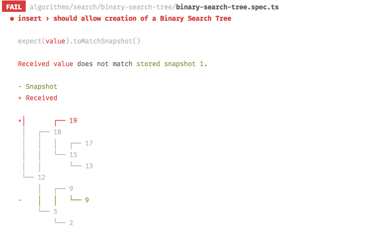

# Pretty algorithms

Common useful algorithms written in modern, pretty and easy-to-understand Javascript along with [real-world usage](#real-world-algorithms) examples. Typescript has been used only for type checking and better auto-documentation, code is in pure ES6.

All the algorithms are also tested using [Jest](http://facebook.github.io/jest/) with the help of custom nice-to-read diffs for data structures.



## Note

The purpose of this repository is to show algorithms written using declarative and intuitive code as much as possible. It's not meant to be used as production. Clarity is favored over performance.

If you need something absolutely performant in production try checking [felipernb/algorithms.js](https://github.com/felipernb/algorithms.js) with low-level optimisations.

## Content

### Miscellaneous 

- [Inversion count](algorithms/misc/inversions-count/inversions-count.ts)
- [Longest common subsequence](algorithms/misc/longest-common-subsequence/longest-common-subsequence.ts)
- [Maximum subarray](algorithms/misc/maximum-subarray/maximum-subarray.ts)
- [Priority queue](algorithms/misc/priority-queue/priority-queue.ts)
- [Rod cutting](algorithms/misc/rod-cutting/rod-cutting.ts)

### Search

- [Binary search](algorithms/search/binary-search/binary-search.ts)
- [Binary search tree](algorithms/search/binary-search-tree/binary-search-tree.ts)

### Sort

- [Counting sort](algorithms/sort/counting-sort/counting-sort.ts)
- [Heap sort](algorithms/sort/heap-sort/heap-sort.ts)
- [Insertion sort](algorithms/sort/insertion-sort/insertion-sort.ts)
- [Merge sort](algorithms/sort/merge-sort/merge-sort.ts)
- [Merge and insertion sort](algorithms/sort/merge-and-insertion-sort/merge-and-insertion-sort.ts)
- [Quick sort](algorithms/sort/quick-sort/quick-sort.ts)
- [Selection sort](algorithms/sort/selection-sort/selection-sort.ts)

## Usage

You can play around with the code cloning the repo and running the following commands:

```bash
npm install
npm test
```

Play around with the source code, the tests and learn algorithms! You can also run the following command to put tests in watch mode and auto-run with changes. [Jest](http://facebook.github.io/jest/) CLI output is awesome!

```bash
npm run test -- --watch
```


## Real-world usage

Some real-world usage of the algorithms to show when they can be applied.

### Longest common subsequence 📐

> The longest common subsequence (LCS) problem is the problem of finding the longest subsequence common to two sequences.
It differs from problems of finding common substrings since subsequences are not required to occupy consecutive positions within the original sequences.

The `longest common subsequence` problem is the basis of data comparison programs such as the diff utility and has applications in bioinformatics (sequences of DNA).  
It is also widely used by revision control systems such as *Git* for reconciling multiple changes made to a revision-controlled collection of files.
[Source](https://en.wikipedia.org/wiki/Longest_common_subsequence_problem)

The LCS problem is also the base of the [edit-distance problem](https://en.wikipedia.org/wiki/Edit_distance), which quantifies how dissimilar two strings are to one another.  
An application of the latter could avoid some security problems, as happened to NPM: [`crossenv` malware on the npm registry](http://blog.npmjs.org/post/163723642530/crossenv-malware-on-the-npm-registry).

### Maximum subarray 📈

> Find the contiguous subarray within an array of numbers which has the largest sum.

The `Maximum subarray` problem is useful to find the range of maximum in a period of events, such as the best moment to buy and sell stock assets knowing their value in a period of time. Another example:

*You have a list of income details for each month of the company ACME for a year of 2016…you have to find out in which part of year the company earns more income and how much it earns.* [Source](https://www.quora.com/What-are-some-applications-of-maximum-subarray-problems)

This algorithm also has been applied to radio telescope images acquired for the Australian square kilometer array pathfinder project. This paper provides an overview of the maximum subarray algorithm and shows how this can be utilized for optical and radio telescope applications. [Source](http://spie.org/Publications/Proceedings/Paper/10.1117/12.928318)

### Priority-queues 🎢

> A priority queue is an abstract data type which is like a regular queue or stack data structure, but where additionally each element has a "priority" associated with it. In a priority queue, an element with high priority is served before an element with low priority.

A `priority queue` can be used for Bandwidth management, Discrete event simulation, Dijkstra's algorithm and so on. Open the
[source](https://en.wikipedia.org/wiki/Priority_queue#Applications) for more details.

### Rod cutting 💰

> Find the best way to cut a rod of length `n`, assuming that each length has a price. Find best set of cuts to get maximum price.

The `Rod cutting` problem can be used to maximize a profit whenever the resources can be divided into minor quantities and sold separately. Useful, isn't it?

### Binary search (tree) 🌳

> Binary search is a search algorithm that finds the position of a target value within a sorted collection.

Some applications of `Binary search`:

- Fast autocomplete/dictionary. [Source](https://www.weheartswift.com/binary-search-applications/)

- `Set` and `Map` implementation of many standard language libraries. [Source](https://stackoverflow.com/a/540191/6860493)

### Sorting 🤔

> A sorting algorithm is an algorithm that puts elements of a list in a certain order

Many computer scientists consider sorting to be the most fundamental problem in the study of algorithms. There are several reasons:

- Sometimes an application inherently needs to sort information. For example, in order to prepare customer statements, banks need to sort checks by check number.

- Algorithms often use sorting as a key subroutine. For example, a program that renders graphical objects which are layered on top of each other might have to sort the objects according to an “above” relation so that it can draw these objects from bottom to top. We shall see numerous algorithms in this text that use sorting as a subroutine.

- We can draw from among a wide variety of sorting algorithms, and they employ a rich set of techniques. In fact, many important techniques used throughout algorithm design appear in the body of sorting algorithms that have been developed over the years. In this way, sorting is also a problem of historical interest.

[Source](https://mitpress.mit.edu/books/introduction-algorithms).

Check instead [this article about pros and cons of each sorting algorithms](http://www.brucemerry.org.za/manual/algorithms/sorting.html).

## TODO

- Add more real-world examples
- Add benchmarks
